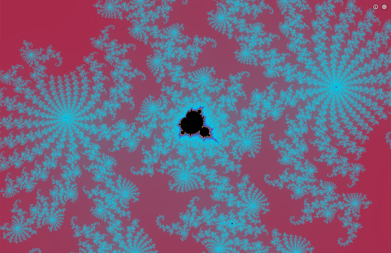

# The Mandelbrot Explorer

<!-- Include labels: ci, others -->

> A web application to traverse the Mandelbrot set fractal

## Features

Zoom and/or pan the screen to explore the Mandelbrot set fractal. Customize the fractal by setting its color scheme or increasing the number of iterations to expand the rendering depth.

For a comprehensive explanation of the Mandelbrot set equation and how the colorful fractal is generated, see the About modal (ⓘ button).

## Internals

Next.js application renders a React Leaflet map, where individual Web Workers from a worker pool color each tile of the map to display the fractal. Worker threads run compiled WebAssembly to efficiently calculate the pixel colors at the current coordinates based on the user-provided color scheme.

Project is deployed to serverless Google Cloud Run through a GitHub Actions workflow.
